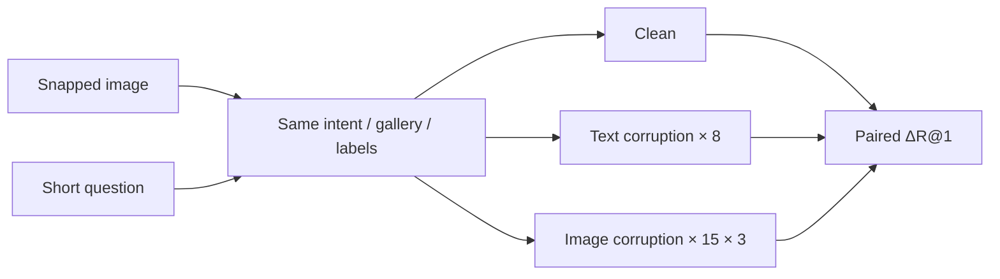

# SnapBench: Benchmarking Snap-and-Ask Multimodal Retrieval for Mobile Interactions

[](https://openreview.net/forum?id=RWvQqyyWr3)
[](https://huggingface.co/datasets/yefd/SnapBench)
[](LICENSE)
[](LICENSE)

**Findings of EMNLP 2026**

[[Paper](https://openreview.net/forum?id=RWvQqyyWr3)] · [[Dataset](https://huggingface.co/datasets/yefd/SnapBench)] · [[Citation](#citation)]

SnapBench is a **paired** benchmark for mobile **snap-and-ask** retrieval: a user takes a photo and asks a short English question. Each query is an image–text pair; the gallery is a shared set of image–caption items. Clean and corrupted variants keep the same target, gallery, and labels, so a score change can be attributed to the input artifact rather than to a new test set.

We also release **MOOR** (Modality-anchored, Outlier-aware, Optimal Reweighting), a training-free adaptive fusion baseline.

## News

- **2026-08-30**: Official repository released. SnapBench is accepted to **Findings of EMNLP 2026**. Dataset: [yefd/SnapBench](https://huggingface.co/datasets/yefd/SnapBench).

## Overview

| | |
|---|---|
| Queries | 1,145 (image + short question) |
| Gallery | 9,085 items (9,059 unique images) |
| Corruption conditions | **53** (45 image + 8 text) |
| Evaluation states | 54 (53 corrupted + 1 clean) |
| Human labels | ~34,000 query–candidate pairs |
| Retrieval modes | II, TT, IT, TI |
| Models in the paper | 16 dual-encoders and VLM embedding models |



**Why another benchmark.** ImageNet-C and TextAttack change the test instance per corruption. SnapBench does not: only the observed query changes. It is also the setting that can measure joint image–text artifacts and the **coarse-text drag** (adding a coarse question can hurt relative to image-only retrieval).

## What Is Included

| Component | Location | Status |
|---|---|---|
| Benchmark metadata | `benchmark/snap_bench.json` | included |
| Query images | `bench_images/query/` (1,145) | included (Git LFS) |
| Gallery images | `bench_images/gallery/` (9,059) | included (Git LFS) |
| Text perturbations | `snap_bench.json` → `text_perturbations` | included |
| Image perturbation files | `bench_images/perturbed/` (~51,675) | **generate locally** |
| Dataset loader + metrics | `snapbench/` | included |
| MOOR | `snapbench/moor.py` | included |
| Score-file evaluation | `eval/` | included |
| Hugging Face copy | [yefd/SnapBench](https://huggingface.co/datasets/yefd/SnapBench) | clean split + metadata |

## Quick Start

### Option A — Hugging Face (data only)

```python
from datasets import load_dataset

queries = load_dataset("yefd/SnapBench", "queries", split="test")
gallery = load_dataset("yefd/SnapBench", "gallery", split="test")
print(queries[0]["text"], queries[0]["positive_gallery_ids"])
```

### Option B — this repository (data + code)

Images are stored with **Git LFS**. Run `git lfs install` once before cloning.

```bash
git lfs install
git clone https://github.com/zrchen03/SnapBench.git
cd SnapBench
git lfs pull
pip install -r requirements.txt
export BENCH_IMAGES_DIR=$(pwd)/bench_images
```

```python
from snapbench import SnapBench

bench = SnapBench()
q = bench.queries[0]
print(q.query_id, q.text, q.entity)
print(q.text_for("char_swap"))
print(len(bench.gallery), "gallery items")
```

Generate the 51,675 image-perturbed queries when you need the full robustness grid:

```bash
python benchmark/gen_image_perturbations.py
# python benchmark/gen_image_perturbations.py --dry-run
```

Output: `bench_images/perturbed/{type}/sev{1,2,3}/{query_id}.jpg`.

## Evaluation

The official metric is **macro-averaged Recall@1** on the shared gallery. Encode with your model, write a `[n_query, n_gallery]` score file, then:

```bash
python eval/eval_from_scores.py --scores scores_clean.npy --k 1
```

Apply MOOR to four embedding matrices from the same frozen encoder:

```bash
python eval/run_moor.py \
  --q-image q_image.npy --q-text q_text.npy \
  --g-image g_image.npy --g-text g_text.npy
```

Details: [docs/EVAL.md](docs/EVAL.md) and [docs/MOOR.md](docs/MOOR.md). Gallery embeddings should be computed once per model and reused across conditions.

This release includes the **loader, metrics, and MOOR**. It does not yet ship 16 full model inference wrappers. If you have embeddings, you can already reproduce the paper's scoring protocol.

## Data Layout

```text
SnapBench/
├── benchmark/
│   ├── snap_bench.json
│   ├── gen_image_perturbations.py
│   └── gen_text_perturbations.py
├── snapbench/                 # loader, metrics, MOOR
├── eval/                      # score-file evaluation
├── docs/
└── bench_images/
    ├── query/
    ├── gallery/
    └── perturbed/             # generated by the image script
```

See [docs/DATA.md](docs/DATA.md) for field definitions and the Hugging Face mapping.

## License and Takedown

- **Code** (scripts, `snapbench`, `eval`): [Apache License 2.0](LICENSE)
- **Data and images**: [CC BY-NC 4.0](https://creativecommons.org/licenses/by-nc/4.0/) — research / non-commercial use only; no commercial redistribution

Web-sourced images can be removed on request. See [TAKEDOWN.md](TAKEDOWN.md). Contact: [imzrchen@gmail.com](mailto:imzrchen@gmail.com), [yongqizhang@hkust-gz.edu.cn](mailto:yongqizhang@hkust-gz.edu.cn).

## Citation

If you use SnapBench or MOOR, please cite:

```bibtex
@inproceedings{chen2026snapbench,
  title     = {{SnapBench}: Benchmarking Snap-and-Ask Multimodal Retrieval for Mobile Interactions},
  author    = {Chen, Zirong and Ye, Fuda and Zhang, Kuan and Du, Enjun and Pu, Junfu and Wang, Xinlei and Zuo, Xinyu and Duan, Lisheng and Ma, Jin and Zhang, Yongqi},
  booktitle = {Findings of the Association for Computational Linguistics: EMNLP 2026},
  year      = {2026}
}
```

A machine-readable copy is in [`CITATION.cff`](CITATION.cff).

## Contact

Zirong Chen ([imzrchen@gmail.com](mailto:imzrchen@gmail.com)) · Yongqi Zhang ([yongqizhang@hkust-gz.edu.cn](mailto:yongqizhang@hkust-gz.edu.cn), corresponding author)
